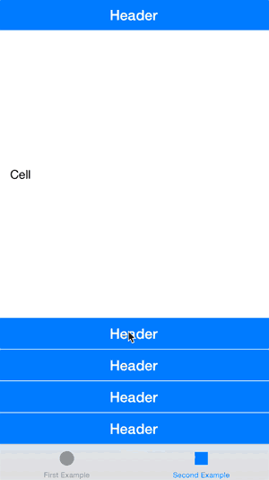

[](https://fuzz-opensource.herokuapp.com/)

## Overview 

FZAccordionTableView transforms your regular UITableView into an accordion table view. The table view section headers are used as tappable areas to collapse rows - just tap a section header, and all of the rows under that section will open below the header and viceversa.

The module is made to be very easy to use and no modifications are necessary to achieve the default behaviour. Just build a table view with cells and section headers and subclass the classes in this module.

### FZAccordionTableView Class:

```swift
class FZAccordionTableView: UITableView {

    var allowMultipleSectionsOpen: Bool
    var keepOneSectionOpen: Bool
    var initialOpenSections: Set<NSNumber>?
    var enableAnimationFix: Bool

    func isSectionOpen(_ section: Int) -> Bool
    func toggleSection(_ section: Int)
    func section(forHeaderView headerView: UITableViewHeaderFooterView) -> Int

}
```

### FZAccordionTableViewHeaderView Class:
```swift
class FZAccordionTableViewHeaderView : UITableViewHeaderFooterView { 

}
```

### FZAccordionTableViewDelegate Protocol:
```swift
protocol FZAccordionTableViewDelegate: NSObjectProtocol {

    func tableView(_ tableView: FZAccordionTableView, canInteractWithHeaderAtSection section: Int) -> Bool

    func tableView(_ tableView: FZAccordionTableView, willOpenSection section: Int, withHeader header: UITableViewHeaderFooterView?)
    func tableView(_ tableView: FZAccordionTableView, didOpenSection section: Int, withHeader header: UITableViewHeaderFooterView?)

    func tableView(_ tableView: FZAccordionTableView, willCloseSection section: Int, withHeader header: UITableViewHeaderFooterView?)
    func tableView(_ tableView: FZAccordionTableView, didCloseSection section: Int, withHeader header: UITableViewHeaderFooterView?)
    
}
```

## How To Use?
### Steps:

1. Add to Podfile: `pod 'FZAccordionTableView', '~> 0.2.3'`
2. Subclass your `UITableView` with `FZAccordionTableView`
3. Subclass your `UITableViewHeaderFooterView` with `FZAccordionTableViewHeaderView`

## Example
 

## How Does it Work?
FZAccordionTableView acts as an intermediator between your implementation of `UITableViewDelegate`/`UITableViewDataSource` and UITableView. FZAccordionTableView implements `UITableViewDelegate` and `UITableViewDataSource`, asks you how many rows you want to display, and reports a different amount to UITableView if a particular section is "closed." Subclassing of UITableViewHeaderFooterView lets FZAccordionTableView know when a particular section is being "opened" or "closed."

## License
FZAccordionTableView is released under the MIT license. See LICENSE for details.
