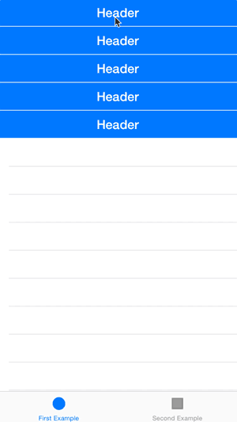

## Overview

FZAccordionTableView transforms your regular UITableView into an accordion table view. The table view section headers are used as tappable areas to collapse rows - just tap a section header, and all of the rows under that section will open below the header and viceversa.

The module is made to be very easy to use and no modifications are necessary to achieve the default behaviour. The table view and the section header has to subclass the classes in this module.

### FZAccordionTableView Class:

~~~objective-c
@interface FZAccordionTableView : UITableView

@property (nonatomic) BOOL allowMultipleSectionsOpen;
@property (nonatomic) BOOL keepOneSectionOpen;
@property (strong, nonatomic) NSSet *initialOpenSections;
@property (strong, nonatomic) NSSet *sectionsAlwaysOpen;
@property (nonatomic) BOOL enableAnimationFix;

- (BOOL)isSectionOpen:(NSInteger)section;
- (void)toggleSection:(NSInteger)section;

@end
~~~

### FZAccordionTableViewDelegate Protocol:
~~~objective-c
@protocol FZAccordionTableViewDelegate <NSObject>

- (void)tableView:(FZAccordionTableView *)tableView willOpenSection:(NSInteger)section withHeader:(UITableViewHeaderFooterView *)header;
- (void)tableView:(FZAccordionTableView *)tableView didOpenSection:(NSInteger)section withHeader:(UITableViewHeaderFooterView *)header;
- (void)tableView:(FZAccordionTableView *)tableView willCloseSection:(NSInteger)section withHeader:(UITableViewHeaderFooterView *)header;
- (void)tableView:(FZAccordionTableView *)tableView didCloseSection:(NSInteger)section withHeader:(UITableViewHeaderFooterView *)header;

@end
~~~

### FZAccordionTableViewHeaderView Class:
~~~objective-c
@interface FZAccordionTableViewHeaderView : UITableViewHeaderFooterView

@property (nonatomic, readonly) NSInteger section;

@end
~~~ 

## How To Use?
### Steps:

1. Add to Podfile: `pod 'FZAccordionTableView', '~> 0.1.3'`
2. Subclass your `UITableView` with `FZAccordionTableView`
3. Subclass your `UITableViewHeaderFooterView` with `FZAccordionTableViewHeaderView`

## Swift Support
FZAccordionTableView works with Swift! Check out the Swift Example in the "Example" folder to see FZAccordionTableView implemented in a Swift project.

## Example
 

## How Does it Work?
FZAccordionTableView acts as an intermediator between your implementation of `UITableViewDelegate`/`UITableViewDataSource` and UITableView. FZAccordionTableView implements `UITableViewDelegate` and `UITableViewDataSource`, asks you how many rows you want to display, and reports a different amount to UITableView if a particular section is "closed." Subclassing of UITableViewHeaderFooterView lets FZAccordionTableView know when a particular section is being "opened" or "closed."

## License
FZAccordionTableView is released under the MIT license. See LICENSE for details.